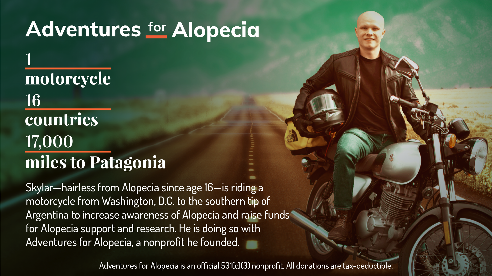

[](https://projectafa.org)

<!-- [](https://github.com/skylarweaver/front-end-afa/blob/release/production/LICENSE) -->

# Adventures for Alopecia: Gatsby + Netlify CMS front-end

## What is Adventures for Alopecia? :motorcycle::dash::dash:

[Adventures for Alopecia](https://projectafa.org) (Project AFA) is a 501(c)(3) nonprofit organization supporting children and adults living with Alopecia. We achieve our mission through three main program areas: support, awareness, and research.

**Support.** We host support group events throughout North America, Central America, and South America.  
**Awareness.** We educate the public about Alopecia through social media, press, word of mouth, and speaking engagements.  
**Research.** We contribute a portion of the funds we raise to the National Alopecia Areata Foundation, an existing 501(c)(3) nonprofit dedicated to discovering a cure for Alopecia.


After Skylar's inaugural Adventure for Alopecia, Project AFA will use donations to sponsor adventures for other Alopecians to regain their confidence through adventure and travel.

## What is this repo?

Here lies the front-end source code for AFA's website, which has two main components marketing/communications to inform the audience of our mission, and a donations portal to allow tax-deductable contributions to support people with Alopecia.

## Tech Stack

### Front-end

*Gatsby.* We use (Gatsby)[https://www.gatsbyjs.org/] to ensure our web app is preformant. 
*Netlify CMS.* We use a Gatsby plugin to implement Netlify CMS to allow GUI content updates while maintaining a static, preformant site.

### Backend

*Lambda.* (Our backend)[https://github.com/skylarweaver/serverless-afa] runs entirely on serverless AWS Lambda functions to process all donations, load map content, and live-update Skylar's motorcycle coordinates.  
*Google Sheeets.* To serve our needs: a simple place to store data that can be viewed and manipulated by both tech-savvy and non-tech-savvy AFA board members, we use Google Sheets as our database.  

### Misc
*Stripe.* We use (Stripe)[https://stripe.com] to handle all donations securely.  
*Estimote.* We use (Estimote's)[https://estimote.com/] LTE Beacon which is installed into Skylar's Motorcycle to track the most recent location and update the map accordingly (after appropriate obfuscation).  

## Setup

### Dependencies

- Node 11.1 or above (We use (nvm)[https://github.com/nvm-sh/nvm])
- [Gatsby CLI](https://www.gatsbyjs.org/docs/)
- A running (backend)[https://github.com/skylarweaver/serverless-afa]

### Run

```
npm i
git clone https://github.com/FiloSottile/mkcert && cd mkcert
npm run start
```

### Build

```
npm run build
```

### Credits
- Developed and maintained by (Skylar Weaver)[https://github.com/skylarweaver]
- UI design by (Z Motahdi)[https://www.linkedin.com/in/zmohtadi/]
- UX Design by (Brendan Sturm)[https://www.linkedin.com/in/bstrahm/]