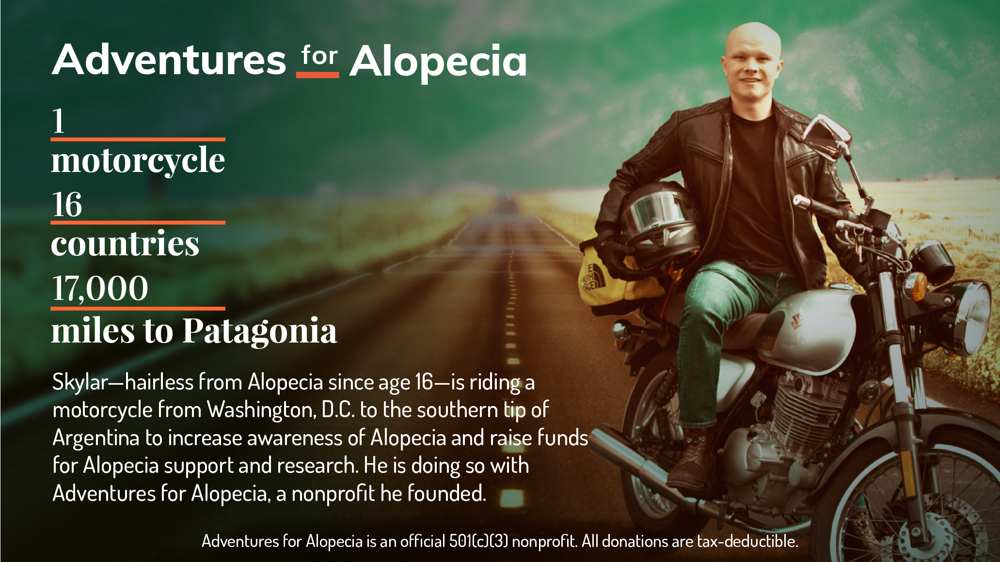

[](https://projectafa.org)

# Adventures for Alopecia: Gatsby front-end (archived)

## What was Adventures for Alopecia? :motorcycle::dash::dash:

[Adventures for Alopecia](https://projectafa.org) (Project AFA) was a 501(c)(3) nonprofit organization supporting children and adults living with Alopecia. From August 2019 to December 2022, Skylar rode a motorcycle 22,000 miles from Washington, D.C. to Ushuaia, Argentina to support people with Alopecia along the way and to raise awareness and funds.

**Support.** We hosted support group events throughout North America, Central America, and South America.
**Awareness.** We educated the public about Alopecia through social media, press, word of mouth, and speaking engagements.
**Research.** We contributed a portion of the funds we raised to the National Alopecia Areata Foundation, an existing 501(c)(3) nonprofit dedicated to discovering a cure for Alopecia.

AFA completed its mission and formally dissolved in July 2023. The website stays online as an archive of the adventure, including the [final report](https://www.projectafa.org/final-report/).

## What is this repo?

The source for the AFA website: a [Gatsby](https://www.gatsbyjs.org/) 2 site hosted on Netlify. Donations closed in 2023, so the site is fully static: the donation total, donor list, and Skylar's final map location are fixed values in `src/data/`. The former serverless backend and Netlify CMS have been removed.

## Setup

The site is pinned to an old toolchain (Node 11, node-sass 4, Gatsby 2). Netlify builds it from `.nvmrc` without changes. On a modern Mac you need an x64 Node 11 under Rosetta; the easiest way to validate a change is to open a pull request, which triggers the "Build site" GitHub Actions workflow and a Netlify deploy preview.

```
nvm install 11
npm ci
npm run develop
```

Analytics: set `GA4_MEASUREMENT_ID` (a Google Analytics 4 measurement ID such as `G-XXXXXXXXXX`) in `.env.production` or in Netlify's environment variables. Without it, no analytics snippet is rendered.

## Freezing the site

Run the "Build site" workflow manually with "publish_archive" checked. It builds the site and pushes the output to the `archive` branch. Point Netlify at that branch with an empty build command and `/` as the publish directory, and the site no longer needs the Node 11 toolchain at all.

## Credits
- Developed and maintained by [Skylar Weaver](https://github.com/skylarweaver)
- UI design by [Z Mohtadi](https://www.linkedin.com/in/zmohtadi/)
- UX Design by [Brendan Strahm](https://www.linkedin.com/in/bstrahm/)
